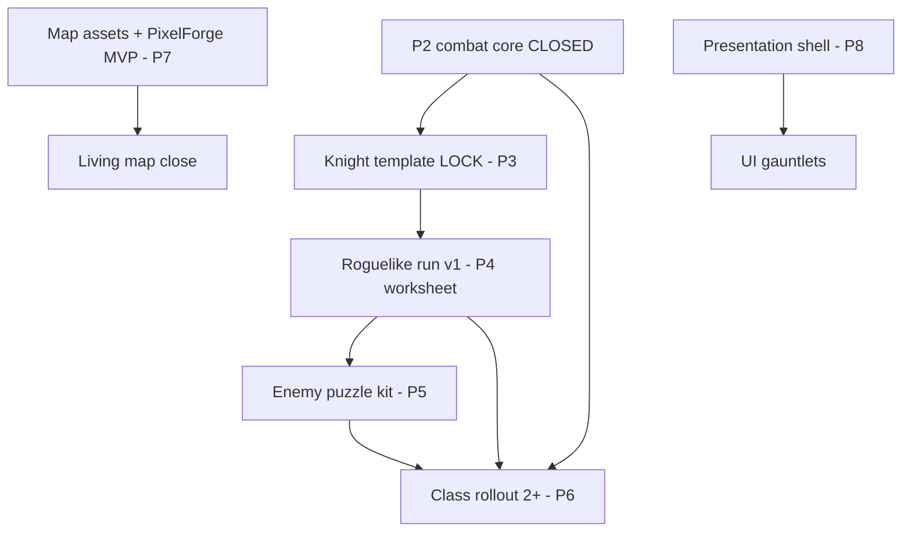

# Living Sandbox Map System — ROADMAP (Canonical)

> **Permanent master plan for this repo.** Do not replace or truncate.  
> Append phase completion notes to `IMPLEMENTATION_STATUS.md`, not this file.  
> Visual/ecology bible: `sandbox_map_system.md` (Living Stillness & Pixel Integrity) · Coding guardrails: `.cursor/rules/living-sandbox-architect.mdc`

**Project:** honor-and-iron-3 (mana-seed-test heritage)  
**Target:** Godot 4.7  
**Current focus:** **Design-suite milestones** (`docs/design/REMAINING_WORK_MAP.md`) — combat parity Ph 10–14 **closed**; living-map phases 0–10 **closed or waived**

Phases ship visible progress with explicit exit criteria. **No phase closes** until criteria pass, including Boredom Tests where marked. **Do not skip phases.**

**Where progress is logged:** Living-map phase audits → `IMPLEMENTATION_STATUS.md`. Active game milestones → `docs/design/` pillar specs + `workbench.md`.

**Phase audit gate (mandatory):** Every phase must be rigorously audited for coherence to rules and code. Re-audit until **≤ 2 issues** remain. See `.cursor/rules/phase-audit.mdc`.

**Phase commit gate (mandatory):** Commit at every phase. Each commit is a **standalone full backup** — reverting to it restores **100% the exact project state** at commit time. See `.cursor/rules/phase-commit.mdc`.

---

## Status at a glance (2026-08-01)

### Cleared — no longer active work

| Track | Scope | Status | Detail |
|-------|--------|--------|--------|
| **Living map** | This file §Phase 0–10 | ✅ **Closed / waived** | User waiver 2026-07-13; compositor F5 checks may remain manual |
| **Bootstrap** | `IMPLEMENTATION_STATUS` Ph 0–2 | ✅ **Closed** | Bridge, skirmish, headless sim |
| **Tactical shell** | `IMPLEMENTATION_STATUS` Ph 3–8 | ✅ **Closed** | Scene, planning, Knight MVP shell |
| **Combat closeout** | `IMPLEMENTATION_STATUS` + parity Ph 10–14 | ✅ **Closed** *(owner 2026-08-01)* | P2 `combat-core-closeout.md` — done for now |
| **Design doc suite** | `docs/design/` W1–W4 | ✅ **15/15 gauntlet PASS** | See `docs/design/GAUNTLET_REVIEW_RESULTS.md` |

### Superseded / failed (do not re-open)

| Item | Status | Superseded by |
|------|--------|----------------|
| `IMPLEMENTATION_STATUS` Phase 9 | ❌ **FAIL** (false PASS) | Parity Ph 10–14 |
| Legacy BoardView combat path | Removed | `TacticalCombat.tscn` is canonical |

### Active — use design suite (not this file’s §0–10 bodies)

| Layer | Doc | Purpose |
|-------|-----|---------|
| **0 — Master map** | [`docs/design/REMAINING_WORK_MAP.md`](docs/design/REMAINING_WORK_MAP.md) | Milestone order + primary commands |
| **1 — Pillars** | [`docs/design/README.md`](docs/design/README.md) | P2–P9 agent contracts |
| **2 — Appendices** | [`docs/design/README.md`](docs/design/README.md) § Appendices | Fixtures, PixelForge, mass-sim, gauntlet prompts |
| **Verification** | [`docs/design/verification-matrix.md`](docs/design/verification-matrix.md) | Machine bar per domain |
| **Gauntlet OS** | [`docs/design/00-gauntlet-loop-cursor.md`](docs/design/00-gauntlet-loop-cursor.md) | Builder/critic loops |

**Owner gates (worksheet before `LOOP_READY`):** P4 roguelike · P5 enemy design · P7 world/map art — see pillar docs.

---

## Living Sandbox Map — Phase Registry (§0–10 below)

> **Historical canonical spec** — phases below remain the bible for map/VFX work. They are **not** the active sprint list; use `docs/design/REMAINING_WORK_MAP.md` for what to build next.

| Phase | Title | Status |
|-------|-------|--------|
| 0 | Project skeleton & asset truth | ✅ Closed |
| 1 | Two-grid core | ✅ Closed |
| 2 | Minimal procedural generator | ✅ Closed |
| 3 | Terrain, decoration & opportunism | ✅ Closed |
| 4 | Wind & grass (GPU) | ✅ Closed *(toggle: Effects `wind_field`)* |
| 5 | Sky, light, atmosphere & shadows | ✅ Closed |
| 6 | Water channel | ✅ Closed |
| 6.5 | Minimal biome gate | ✅ Closed |
| 7 | Ecology & full motion set | ✅ Closed |
| 8 | Biome / palette swap | ✅ Closed |
| 9 | Full opportunism & composites | ✅ Waived / partial |
| 10 | Full audit & tactics bridge | ✅ Closed (waiver) |

---

## Asset Inventory (Verified — Do Not Hallucinate Beyond This)

| Asset | Location | Versions present | Notes |
|-------|----------|------------------|-------|
| Gentle Forest terrain | `gentle sheets/gentle forest v0X.png` | **v01–v03 only** | 16×16, Wang autotile rules in `.tsx` |
| Gentle 32×32 props | `gentle sheets/gentle 32x32 v0X.png` | **v01–v03 only** | Overlay layer |
| Trees | `gentle sheets/gentle trees 80x96 v0X.png` | **v01–v03 only** | 80×96, 2 tiles per sheet |
| Water sparkles | `gentle animations/gentle water sparkles A v0X.png` | **v01–v03 only** | 3-frame loops |
| Waterfalls | `gentle animations/gentle waterfall A v0X.png` | **v01–v03 only** | Multi-part animated system |
| Seasonal samples | root `seasonal sample (*.png)` | autumn, summer, winter | Reference only, not full tilesets |
| `.tsx` definitions | root | v01–**v10** declared | **v04–v10 PNGs missing** — Phase 8 blocked for those until acquired |

**Phase 0 must write `docs/asset_manifest.md`** from this inventory. Do not reference tiles/atlases not on disk.

**Biome note:** Architect rule "Y-offset seasonal swap" applies when a single atlas contains stacked seasons. This pack uses **separate PNG per palette** for v01–v10. `BiomeProfile` must abstract both strategies: `atlas_y_offset` (future seasonal bundle) and `tileset_variant_index` (current Gentle Forest PNG swap).

---

## Design Principles

| Principle | Enforcement |
|-----------|-------------|
| 20/80 rule | Mana Seed = static anchor (~20%); code = motion, atmosphere, ecology (~80%) |
| Living Stillness | Stillness is a valid environmental state; motion gains value from contrast — not perpetual screensaver motion |
| Pixel integrity | Preserve pixel clusters; static sprite beats smeared sprite; see bible §2 Forbidden List |
| SubViewport Lock | Retro internal resolution root (e.g. 320×180) scaled up — prevents sub-pixel sprite smear (bible §1) |
| Subpixel Camera Glide | Logic camera snaps to integer pixels; display offset carries fractional remainder for smooth pan (bible §2 Rule 6) |
| Animation priority ladder | Palette cycle → occlusion/light → particles → sprite swap → **spring translation (2nd-order, integer snap)** → hierarchical reaction → quantized displacement; UV warp forbidden |
| Temporal quantization | Stepped shader time (e.g. `floor(TIME * 6.0) / 6.0`); no 60 fps continuous interpolation on environmental motion |
| Procedural springs | Translation-only Second-Order Dynamics; no squash/stretch/rotation; final output snapped to integer pixels (bible §2 Rule 2 #5) |
| No hallucination | Only use assets in `docs/asset_manifest.md` |
| Two-grid separation | Player Grid never draws; Auto-Decorator owns all `TileMapLayer` writes |
| Render Grid | Ephemeral computed tile indices inside Auto-Decorator — not a second persisted array |
| GPU over CPU | Shaders + `GPUParticles2D`; no `_draw()` or per-tile `_process()` at scale |
| Global Wind Field | CPU-driven target vectors smoothly interpolated; grass/trees/particles sample **world coordinates** — no per-tile isolated timers |
| Determinism | Map seed → generator output → decorator RNG → identical visuals |
| Bible compliance | Channel checklist + Boredom Test + Screenshot/Sprite Authorship Test gates |
| Battlefield presence first | Prefer presence over code simplicity when tradeoffs exist |
| Sufficiency | Never close a motion phase after only one environmental effect |
| Constraint B nuance | `sin()` allowed as a component — never the sole motion driver for a system |
| Nearest filtering only | All materials, canvases, `TileMapLayer` — no smooth sub-pixel interpolation |
| Strict palette shadows | Multiply or strict palette-shifted drop shadows via 1D LUT — no generic black alpha blobs |
| Phase audit gate | Re-audit each phase against rules + code until ≤ 2 issues remain |
| Phase commit gate | One full-backup commit per phase; revert = exact playable state |
| Changelog on edits | Detailed Before → After required on every edit turn |
| Feature toggles | Every living-system effect → `EffectsSettings` key + `EffectsPanel` row + `EffectsController.apply_*`; persisted in `user://game_settings.cfg` |

---

## Architecture (Locked From Phase 0)

```
Scene Root (Node2D)
├── SubViewportContainer          (Phase 0 — SubViewport Lock, bible §1)
│   └── GameSubViewport           (Phase 0 — e.g. 320×180 internal; Nearest upscale)
│       ├── DisplayOffset (Node)  (Phase 0 — Subpixel Camera Glide fractional remainder)
│       ├── CanvasModulate        (Phase 5 — palette LUT tint)
│       ├── SkyOverlay (Node2D)   (Phase 5 — cloud shadows, mist quads)
│       ├── MapRoot (Node2D)
│       │   ├── GroundLayer       (TileMapLayer — 16×16 terrain, Nearest)
│       │   ├── OverlayLayer      (TileMapLayer — props, composites, y_sort)
│       │   └── VFXLayer          (TileMapLayer — sparkles; Phase 6+)
│       └── EcologyLayer (Node2D) (Phase 7 — GPUParticles2D, sparse actors)
└── Autoloads
    ├── WindBus                   (Phase 4 — Global Wind Field, world-space sampling)
    └── WeatherBus                (Phase 5 — composition; light, mist, humidity, ripple multiplier)
```

**Bible §3 Master Implementation Stack (12 items) → phases:**

| # | Stack item | Phase |
|---|------------|-------|
| 1 | SubViewport Lock & Subpixel Camera Glide | 0 |
| 2 | Palette LUT System | 0 (stub) / 5 (active) |
| 3 | Global Wind Field (CPU-interpolated, world coords) | 4 |
| 4 | Cloud Shadow System | 5 |
| 5 | Palette Cycling | 6 |
| 6 | Dithered Atmospheric Lighting | 5 |
| 7 | Pixel Particles | 7 |
| 8 | Procedural Spring Logic (translation-only, integer snap) | 7 |
| 9 | Environmental State Machines | 7 |
| 10 | Rare Ambient Director | 7 |
| 11 | Pixel Height Shadows | 5 (stub) / 9 (full) |
| 12 | Biome Ecology Systems | 8–9 |

**No legacy `TileMap` node.** Multiple `TileMapLayer` nodes are children of `MapRoot`.

**Player Grid:** `Array[Array[int]]` — logical `TileID` only.  
**Participation:** Derived from `TileID` via registry below — no parallel metadata flags.  
**Auto-Decorator:** PlayerGrid + seeded RNG → Render Grid (internal) → `TileMapLayer` cells.

### TileID → Participation Registry (Constraint A)

| TileID | Living system(s) | Active from |
|--------|------------------|-------------|
| GRASS | Global Wind Field; cloud shadow tint; frame swap / integer shift (not UV warp) | Phase 4 / 5 |
| DIRT | Global Wind Field; cloud shadow tint | Phase 4 / 5 |
| WATER | Palette-cycling ripples; sparkles | Phase 6 |
| RUIN | Moving cloud shadows (multiply); may remain mostly still (Stillness Principle) | Phase 5 |
| ROCK | Moving cloud shadows (multiply); may remain mostly still | Phase 5 |
| TREE | Canopy states / leaf particles / shadow movement; Global Wind Field; ecology spawn | Phase 4 / 5 / 7 |

### Interim Participation Exemptions

Phases 4–5 may close with WATER/RUIN still static **only** on test maps that exclude those types. Any map containing a tile type must enroll it before that phase's Boredom Test passes. Phase 6.5 enforces full enrollment for GRASS + WATER.

---

## Motion Archetype Tracker

All six archetypes must exist before Phase 7 closes. Track in `IMPLEMENTATION_STATUS.md`.

| Archetype | Implementation | First appears | Verified |
|-----------|----------------|---------------|----------|
| Oscillation | Grass/tall vegetation wind shader | Phase 4 | Phase 7 |
| Wave propagation | Gust front across grid | Phase 4 | Phase 7 |
| Drift | Cloud shadows, mist | Phase 5 | Phase 7 |
| Flutter | Butterflies, falling leaves | Phase 7 | Phase 7 |
| Random wandering | Fireflies near water | Phase 7 | Phase 7 |
| Bursts | Fish splash (preview Phase 6), gust burst, splash particles | Phase 6–7 | Phase 7 |

Neighboring systems must not share identical math. Coordinated, never synchronized. **Temporal staggering** (bible §4C): grass ~8 fps stepped, clouds macro-drift, pollen burst intervals, birds 90–300 s — different clocks, not one global `sin(TIME)`.

---

## Temporal Scale Matrix (Phase 10 Validation)

| Scale | Examples | Phase |
|-------|----------|-------|
| Macro | Biome palette swap, day/night `CanvasModulate` | 5, 8 |
| Regional | Cloud shadow drift, wind gust across field | 4, 5 |
| Local | Tree canopy sway, shoreline foam | 4, 6 |
| Micro | Grass shader pixel offset, pollen particles | 4, 7 |

---

## Channel Audit — Gate vs Final

| Channel | Item | Required at 6.5 gate | Final (Phase 10) |
|---------|------|---------------------|------------------|
| Sky | CanvasModulate (palette LUT) | ✓ | ✓ |
| Sky | Cloud shadows | ✓ | ✓ |
| Atmospheric | Fog/mist/humidity | ✓ (mist + humidity) | ✓ |
| Atmospheric | Dithered light shafts | ✗ (Phase 5+) | ✓ |
| Atmospheric | Micro-particles | ✗ (Phase 7) | ✓ |
| Weather / Wind | Global Wind Field | ✓ | ✓ |
| Weather / Wind | Shaders/particles sample wind bus | ✓ | ✓ |
| Ground | Terrain variation | ✓ | ✓ |
| Ground | Procedural decoration (incl. crops) | ✗ (Phase 3; optional at 6.5) | ✓ |
| Vegetation | Grass response (swap / integer shift) | ✓ | ✓ |
| Vegetation | Tree response (states, leaves, shadow) | ✗ (no trees at 6.5) | ✓ |
| Water | Ripples (palette cycling preferred) | ✓ | ✓ |
| Water | Shoreline foam | ✓ | ✓ |
| Lighting | Crisp shadows (pixel height / Z) | ✓ (no obstacles at 6.5) | ✓ |
| Lighting | Weather/time light shift (LUT) | ✓ | ✓ |
| Ecology | Wildlife/organic matter (staggered clocks) | ✗ (Phase 7) | ✓ |
| Ecology | Rare ambient events | ✗ (Phase 7) | ✓ |

---

## Opportunism Loop (Incremental)

| Step | Action | Phase |
|------|--------|-------|
| 1 | Generate object | 3 |
| 2 | Surroundings (moss, base tiles) | 3 |
| 3 | Drop shadow | 5 |
| 4 | Ambient life | 7 |
| 5 | Canopy sun-shaft blocking | 9 |
| 6 | Recurse | 9 |

`scripts/ecology_seeder.gd` stubbed Phase 3 (registry only); unified 6-step entry Phase 9.

---

## Phase 0 — Project Skeleton & Asset Truth

**Goal:** Godot 4.7 project rendering the sample map with verified assets.

### Deliverables
- `project.godot` — renderer: compatibility or forward+; **texture filter: Nearest**; pixel snap enabled
- **SubViewport Lock** — retro internal resolution pipeline (e.g. 320×180) scaled up (bible §1, §3 #1)
- **Subpixel Camera Glide** — integer logic camera + fractional display offset on upscale quad/shader (bible §2 Rule 6)
- **Palette LUT stub** — Mana Seed color-space mapping hook (bible §3 #2)
- Folders: `scenes/`, `scripts/`, `shaders/`, `resources/`, `docs/`
- `docs/asset_manifest.md` — every PNG on disk with dimensions
- `docs/tile_registry.md` — TileID → atlas coords for GRASS, WATER, DIRT, TREE, RUIN, ROCK
- `IMPLEMENTATION_STATUS.md` — stub with channel checklist (all unchecked)
- Import `gentle forest v01` (+ trees, sparkles, 32×32 from sample `.tmx`) → Godot `TileSet` resources
- Configure Godot **TerrainSet** peering from Wang colors in `gentle forest v01.tsx` (dirt-on-grass, elevation, water-on-grass)
- Test scene: `GroundLayer`, `OverlayLayer`, `VFXLayer` under `MapRoot`
- Render `_gentle forest sample map.tmx` layout (17×10 reference)
- **Delete** nested duplicate `Assets/Mana Seed/Mana Seed/` (do not leave ignored)

### Exit Criteria
- [ ] Sample map visible, rabite-forest (v01), crisp at integer zoom
- [ ] SubViewport internal resolution locked (SubViewport Lock)
- [ ] Camera pans smoothly without pixel shimmer (Subpixel Camera Glide)
- [ ] 16×16 logical grid confirmed
- [ ] Three `TileMapLayer` nodes, no legacy `TileMap`
- [ ] `asset_manifest.md` matches disk; missing PNGs flagged
- [ ] TerrainSet peering configured (Wang rules documented in `tile_registry.md`)
- [ ] `IMPLEMENTATION_STATUS.md` exists

### Boredom Test: N/A

---

## Phase 1 — Two-Grid Core

**Goal:** Permanent data/render separation with deterministic decoration.

### Deliverables
- `scripts/tile_id.gd` — enum: GRASS, WATER, DIRT, TREE, RUIN, ROCK
- `scripts/player_grid.gd` — `Array[Array[int]]`, set/get, dimensions
- `scripts/auto_decorator.gd` — reads PlayerGrid; seeded `RandomNumberGenerator` (seed from map seed); writes layers
- `regenerate()` — full rebuild Ground + Overlay from PlayerGrid
- Hardcoded 16×16 test map in PlayerGrid

### Exit Criteria
- [ ] Cell change + `regenerate()` updates visuals
- [ ] Same seed → same decorative variants every run
- [ ] No code outside Auto-Decorator writes tile cells
- [ ] Ground and overlay on separate `TileMapLayer` nodes

### Boredom Test: N/A

---

## Phase 2 — Minimal Procedural Generator

**Goal:** Seeded procedural PlayerGrid.

### Deliverables
- `scripts/map_generator.gd` — outputs PlayerGrid
- Export: `width`, `height`, `water_ratio`, `seed`
- Algorithm: cellular automata or flood-fill regions (start simple)
- Regenerate hotkey in test scene

### Exit Criteria
- [ ] Same seed → identical PlayerGrid
- [ ] Coherent land and water bodies
- [ ] 16×16 through 32×32 supported

### Boredom Test: N/A

---

## Phase 3 — Terrain, Decoration & Opportunism (Steps 1–2)

**Goal:** Wang-aware edges, weighted decoration, tree stubs, opportunism begins.

### Deliverables
- Auto-Decorator uses **TerrainSet** peering for grass/dirt/water transitions (not hand-picked edge tables alone)
- Weighted grass/dirt variants (3+ per type, seeded)
- Shoreline/water edges via terrain peering
- Scatter: pebbles, weeds, **flowers (104–106)**, **Mana Seed crops** (low weight, from available prop tiles)
- TREE on PlayerGrid → single-tile stub on OverlayLayer + moss/base neighbors (steps 1–2)
- `ecology_seeder.gd` stub: registers which TileIDs trigger opportunism (no full loop yet)

### Exit Criteria
- [ ] No orphan water without terrain-peeked shores
- [ ] Decoration density export var
- [ ] TREE → moss/base auto-placed
- [ ] Crops appear in decoration pool
- [ ] Tactics-readable at default zoom

### Boredom Test: N/A (static; visual review only)

---

## Phase 4 — Wind & Grass (GPU)

**Goal:** Global Wind Field; living motion via animation priority ladder (bible §2); oscillation + wave propagation; ≥2 systems.

### Deliverables
- `autoload/wind_bus.gd` — **Global Wind Field**: CPU-driven target vectors smoothly interpolated; direction, turbulence, gust strength, gust front position (bible §3 #3)
- `shaders/wind_grass.gdshader` — samples WindBus; **world-space** coordinates; **integer-quantized** displacement only (`round()`/`floor()`); stepped timing e.g. `floor(TIME * 6.0) / 6.0` (~8 fps effective)
- **Forbidden:** per-tile isolated timers, `VERTEX.x += sin(TIME)`, UV warp, sub-pixel displacement (bible §2 Rule 1)
- Grass + DIRT: wind material via ladder (prefer sprite swap / integer shift before deformation)
- Gust wave propagation across rows/columns (not global sync `sin(TIME)`)
- TREE stub (if present): canopy states / leaf particles / shadow reaction — not rubber-band bend

### Exit Criteria
- [ ] All grass/DIRT shaders sample Global Wind Field (not local isolated phase)
- [ ] Gust wave rolls across field
- [ ] No forbidden deformation (screenshot test on grass frame)
- [ ] No per-tile `_process`
- [ ] Sufficiency: oscillation + wave propagation active

### Boredom Test (16×16 GRASS + DIRT only)
- [ ] 60s idle: motion non-repetitive and non-synchronized; stillness intervals present (Stillness Principle)

---

## Phase 5 — Sky, Light, Atmosphere & Shadows

**Goal:** Sky + atmospheric + lighting + weather/wind enrollment; opportunism step 3; ≥2 systems.

### Deliverables
- `CanvasModulate` — palette LUT tint (Mana Seed color space)
- Cloud shadows: fullscreen `ColorRect` + shader, **Multiply** blend, world-space Perlin drift, clamped darkening (bible §3 #4)
- Mist/fog + **dithered light shafts** for forests/ruins (stepped; no soft gradient blur)
- Humidity: WeatherBus darkens/tints `CanvasModulate` when `water_ratio` high
- `autoload/weather_bus.gd` — time preset, mist density, humidity, ripple multiplier
- Drop shadows: **strict palette-shifted** or Bayer multiply via 1D LUT; **pixel height / Z** stub (bible §3 #11 preview)
- Cloud shadow enrollment for RUIN/ROCK/TREE/GRASS/DIRT; ruins may remain mostly still

### Exit Criteria
- [ ] Cloud shadows drift (Sky channel)
- [ ] Mist + humidity + dithered shafts active (Atmospheric channel)
- [ ] Weather/Wind channel: WindBus consumed by atmosphere where applicable
- [ ] Crisp obstacle shadows, no black alpha blobs (Lighting channel)
- [ ] `CanvasModulate` shifts with WeatherBus time preset (LUT)
- [ ] Tactics readability preserved
- [ ] Sufficiency: cloud drift + light/time shift

### Boredom Test (16×16 GRASS + RUIN)
- [ ] 60s idle: shadows move; ruins participate via cloud shadows

---

## Phase 6 — Water Channel

**Goal:** Water enrolled; ripples + shoreline; burst preview.

### Deliverables
- Water ripples via **palette cycling** first (bible §2 ladder #1, §3 #5); shader displacement only if integer-quantized ≤1 px stepped
- `shaders/water_ripple.gdshader` — WindBus direction, WeatherBus intensity (if shader path used)
- Shoreline foam at water/land boundary (extends terrain peering)
- Sparkles on `VFXLayer` — Godot animated tiles from `gentle water sparkles A v01` OR palette-cycle equivalent
- Rare fish splash burst at deep water (preview; full director in Phase 7)
- Waterfalls: **deferred** — document in `IMPLEMENTATION_STATUS.md` as post-v1 if elevation not in generator

### Exit Criteria
- [ ] Ripples respond to wind (palette cycle or quantized shader)
- [ ] Shoreline foam at boundaries
- [ ] Water bodies read connected
- [ ] Screenshot test passes on water frames (no heat haze / UV warp)
- [ ] Sufficiency: ripples + shoreline foam

### Boredom Test (16×16 GRASS + WATER)
- [ ] 60s idle: water motion continuous, not synced with grass

---

## Phase 6.5 — Minimal Biome Gate (Bible §6–7)

**Goal:** Grass + water only feels overwhelmingly alive **with deliberate stillness**. **Blocks Phase 7.**

### Deliverables
- 16×16 map: GRASS + WATER only
- Active: wind, gust, cloud shadows, mist, humidity, ripples, foam, light shift
- Record gate matrix in `IMPLEMENTATION_STATUS.md`

### Exit Criteria
- [ ] Boredom Test **PASSED** — 60s idle, not repetitive/frozen/synchronized
- [ ] GRASS + WATER both enrolled (Participation Registry)
- [ ] Gate channel matrix (see table above) satisfied for present types
- [ ] Failure → fix Phase 4/5/6, do not proceed

---

## Phase 7 — Ecology, Full Motion Set & Rare Events

**Goal:** All six archetypes; behavior rest states; ecology channel; opportunism step 4.

### Deliverables
- `GPUParticles2D`: pollen, spores, dandelion seeds — **density ebbs/flows**; **temporal staggering** per bible §4C (pollen bursts ~12 s, birds 90–300 s)
- `scripts/second_order_spring.gd` (or equivalent) — **translation-only** procedural springs; Second-Order Dynamics; integer pixel snap; for signs, loot bob, hanging vines (bible §3 #8)
- Sparse actors (state machine Active/Idle/Transition):
  - Butterfly (lands on crop/grass)
  - Falling leaf (stops on ground)
  - Firefly (wanders near water; density varies)
- `scripts/ambient_event_director.gd` — seeded rare events (bible §3 #9):
  - Bird flyover, fish splash, heavy wind gust, firefly swarm
- Readability enforcer: ≤5 high-attention effects on screen
- **Pixel particles** — SNES-style rigid particles; no additive glow clouds (bible §3 #7)
- Tree cells → butterfly/leaf spawn weights (opportunism step 4)

### Exit Criteria
- [ ] All six motion archetypes verified
- [ ] Actors rest — no perpetual identical loops
- [ ] Pollen density ebbs and flows
- [ ] Rare events novel over 5+ minutes
- [ ] High-attention ≤ 5
- [ ] Sufficiency: particles + resting actor + event director
- [ ] Boredom Test **PASSED** — 32×32 generated map

---

## Phase 8 — Biome / Palette Swap (Math, Not UI)

**Goal:** Data-driven biome swap without repainting PlayerGrid.

### Deliverables
- `resources/biome_profile.gd` — fields: `tileset_variant` (1–3 for current assets), `particle_tint`, `CanvasModulate` preset, `mist_density`; future: `atlas_y_offset`
- Auto-Decorator selects atlas/TileSet variant from profile
- Biome change → `regenerate()` re-runs full decorator + opportunism stubs
- WeatherBus hooks per biome

### Asset reality
- **Now:** 3 biomes (v01 rabite, v02 jungle, v03 moonlight) — not 4 seasons
- **When v07–v10 PNGs acquired:** map to spring/summer/autumn/winter without code rewrite
- Phase 8 passes with **3 palettes**; 4-season label applied only when assets exist

### Exit Criteria
- [ ] Same PlayerGrid → distinct visuals per available palette (≥3)
- [ ] Swap is export-var / enum driven, no manual tile painting
- [ ] `regenerate()` called on biome change
- [ ] Boredom Test per palette — 60s idle each

---

## Phase 9 — Full Opportunism & Multi-Tile Composites

**Goal:** Steps 5–6; 80×96 trees; tree wall; unified seeder.

### Deliverables
- Upgrade TREE stub → 80×96 multi-cell footprint on OverlayLayer (single-organism wind; no per-tile seam tear)
- Tree wall assets (if map uses wall segments) — stitched as one composite
- Canopy sun-shaft blocking + dithered filtering (step 5)
- **Pixel height shadows** — Z-height 0/1/2 shadow angles (bible §3 #11)
- Recursion with depth cap (step 6)
- `ecology_seeder.gd` — full 6-step loop entry for any TileID
- Biome-aware: composites respect active `BiomeProfile` variant

### Exit Criteria
- [ ] Place TREE → full loop executes
- [ ] Multi-tile trees sway seamlessly
- [ ] Recursion depth capped and documented
- [ ] Boredom Test **PASSED** — trees + ruins + water map

---

## Phase 10 — Full Audit & Tactics Bridge

**Goal:** v1 complete; tactics-ready export.

### Deliverables
- `IMPLEMENTATION_STATUS.md` — all channels, archetypes, temporal scales, Always Ask answers
- Full Battlefield Presence Audit (`sandbox_map_system.md` §7)
- Final Validation + **Screenshot Test & Sprite Authorship Test** (`sandbox_map_system.md` §8)
- `scripts/walkability.gd` — WATER, TREE, RUIN block; GRASS, DIRT walkable
- PlayerGrid export format + `docs/player_grid_api.md`

### Exit Criteria
- [ ] Every final channel checkbox populated (including Weather/Wind)
- [ ] All six archetypes documented with live examples
- [ ] Temporal scales demonstrated; staggered clocks verified
- [ ] Coordinated, not synchronized; stillness intervals observed where appropriate
- [ ] **Sprite Authorship Test passed** on grass, water, tree, particle, and spring-bob frames
- [ ] Boredom Test **PASSED** — 32×32 final
- [ ] Stop criterion: more effects would add clutter
- [ ] Walkability + export API documented

---

## Session Flow

```
Phase 0   Skeleton + asset manifest
    ↓
Phase 1   Two-Grid + seeded decorator
    ↓
Phase 2   Generator
    ↓
Phase 3   Terrain peering + decoration + opportunism 1–2
    ↓
Phase 4   Wind                              ← Boredom Test
    ↓
Phase 5   Sky / mist / shadows              ← Boredom Test
    ↓
Phase 6   Water                             ← Boredom Test
    ↓
Phase 6.5 GRASS+WATER GATE                  ← Boredom Test (blocks 7)
    ↓
Phase 7   Ecology + all archetypes          ← Boredom Test
    ↓
Phase 8   Biome swap (3 palettes now)       ← Boredom Test each
    ↓
Phase 9   Full opportunism + composites     ← Boredom Test
    ↓
Phase 10  Full audit + tactics bridge
```

---

## Per-Phase Documentation (Every Phase)

Update `IMPLEMENTATION_STATUS.md`:
1. Phase number and date
2. **Always Ask** (all 8 questions answered):
   - What moves?
   - What is deliberately still?
   - What casts a shadow?
   - What reacts to wind?
   - What reacts to weather?
   - What varies over time?
   - What small life exists here?
   - What visual channel is still underused?
3. Channel checklist (gate vs final columns; include Weather/Wind)
4. Boredom Test result (pass / fail / N/A)
5. Screenshot / Sprite Authorship Test (pass / fail / N/A) — motion phases onward
6. **Phase audit** — iteration count, issues found/fixed, final count (must be ≤ 2), pass/fail
7. **Phase commit** — hash, message (`Complete Phase N: …`)
8. Known gaps for next phase

---

## Vibe Coding vs Agent

| You | Agent |
|-----|-------|
| "More water, moodier" | Generator weights, WeatherBus humidity |
| "Too busy" | Readability budget |
| "Summer palette" | BiomeProfile variant (when asset exists) |
| "Pond with fireflies" | Ecology seeding on water cluster |
| "Feels dead" | Diagnose empty channel; propose fix |

---

## Honor & Iron — Remaining Work (Design Suite)

> **Added 2026-08-01.** Agent-executable milestone layer. Does **not** replace living-map §0–10 or `TACTICAL_COMBAT_PARITY_PLAN.md` — links them.

### Suite index

| Doc | Role | Gauntlet |
|-----|------|----------|
| [`00-remaining-work-suite-plan.md`](docs/design/00-remaining-work-suite-plan.md) | How W1–W4 was built | POLISHED (91) |
| [`01-doc-polish-protocol.md`](docs/design/01-doc-polish-protocol.md) | Doc polish process (P1) | POLISHED (91) |
| [`REMAINING_WORK_MAP.md`](docs/design/REMAINING_WORK_MAP.md) | **Layer 0** — what to build | LOOP_READY |
| [`verification-matrix.md`](docs/design/verification-matrix.md) | Machine bar per domain (P9) | LOOP_READY |
| [`00-gauntlet-loop-cursor.md`](docs/design/00-gauntlet-loop-cursor.md) | Builder/critic loop OS | ACTIVE |
| [`GAUNTLET_REVIEW_RESULTS.md`](docs/design/GAUNTLET_REVIEW_RESULTS.md) | Scoreboard | **15/15 PASS** |

### Milestone index (dependency order)

| # | Milestone | Pillar | Primary command | Spec status |
|---|-----------|--------|-----------------|-------------|
| 1 | Parity Ph 10–13 combat core | P2 `combat-core-closeout.md` | `.\scripts\run_regression_tests.ps1` | ✅ **Closed** *(owner 2026-08-01)* |
| 2 | Phase 14 Knight MVP re-gate | P2 | `.\scripts\run_planning_qa_gate.ps1` | ✅ **Closed** *(owner 2026-08-01)* |
| 3 | Knight template LOCK | P3 `knight-template.md` | `PLANNED — scripts/run_knight_qa_gate.ps1` | **Active** |
| 4 | Roguelike run v1 | P4 `roguelike-run.md` | `PLANNED — tests/run_state_test.gd` | DRAFT *(worksheet gate)* |
| 5 | Enemy puzzle kit | P5 `enemy-design.md` | `tests/bridge_test_runner.gd` | DRAFT *(worksheet gate)* |
| 6 | Class rollout 2+ | P6 `class-rollout.md` | Planning gate + skill scenarios | LOOP_READY |
| 7 | Map assets + PixelForge MVP | P7 `world-assets-and-map.md` | `docs/asset_manifest.md` | DRAFT *(worksheet gate)* |
| 8 | Living map ROADMAP close | P7 | F5 compositor gate | PLANNED |
| 9 | UI + SFX shell | P8 `presentation-audio-ui.md` | SfxPlayer DEFS map in P8 doc | LOOP_READY |
| 10 | UI gauntlets polish | P8 | P8 checklist | PLANNED |

### Pillar specs (P2–P9)

| ID | Document | Status |
|----|----------|--------|
| P2 | [`combat-core-closeout.md`](docs/design/combat-core-closeout.md) | CLOSED *(owner 2026-08-01)* |
| P3 | [`knight-template.md`](docs/design/knight-template.md) | LOOP_READY |
| P4 | [`roguelike-run.md`](docs/design/roguelike-run.md) | DRAFT |
| P5 | [`enemy-design.md`](docs/design/enemy-design.md) | DRAFT |
| P6 | [`class-rollout.md`](docs/design/class-rollout.md) | LOOP_READY |
| P7 | [`world-assets-and-map.md`](docs/design/world-assets-and-map.md) | DRAFT |
| P8 | [`presentation-audio-ui.md`](docs/design/presentation-audio-ui.md) | LOOP_READY |
| P9 | [`verification-matrix.md`](docs/design/verification-matrix.md) | LOOP_READY |

### Appendices (Layer 2)

| Document | Status |
|----------|--------|
| [`encounter-fixture-format.md`](docs/design/appendices/encounter-fixture-format.md) | LOOP_READY |
| [`pixelforge-v14-contract.md`](docs/design/appendices/pixelforge-v14-contract.md) | LOOP_READY |
| [`mass-sim-balance.md`](docs/design/appendices/mass-sim-balance.md) | LOOP_READY |
| [`gauntlet-prompt-library.md`](docs/design/appendices/gauntlet-prompt-library.md) | LOOP_READY |

### Critical path



**Authority:** Full matrix and bars → [`verification-matrix.md`](docs/design/verification-matrix.md). Do not invent parallel QA paths.

---

## Next Step

**Active sprint:** Design-suite milestones per [`REMAINING_WORK_MAP.md`](docs/design/REMAINING_WORK_MAP.md).

**Recommended order (P2 closed 2026-08-01):**

1. **Knight LOCK (P3):** Design `run_knight_qa_gate.ps1` + per-skill scenarios (`knight-template.md`) — **not** the planning QA gate
2. **Owner:** Fill P4 / P5 / P7 worksheets when ready for roguelike / enemies / map art
3. **Roguelike v1 (P4):** `RunState` + `tests/run_state_test.gd` after worksheet
4. **Enemy puzzles (P5):** Fixture loader + `tests/fixtures/encounters/` per appendix
5. **Class rollout (P6):** Clone P3 pipeline per `class-rollout.md`
6. **World + PixelForge (P7):** CANON promote loop per `pixelforge-v14-contract.md`
7. **Presentation (P8):** Wire remaining SfxPlayer / HUD rows

*P2 combat-core (parity Ph 10–14): owner closed for now — reopen only for regressions or Phase 15 MP path.*

**Implementation status:** [`IMPLEMENTATION_STATUS.md`](IMPLEMENTATION_STATUS.md)  
**Combat detail:** [`docs/TACTICAL_COMBAT_PARITY_PLAN.md`](docs/TACTICAL_COMBAT_PARITY_PLAN.md)  
**Gauntlet live scores:** [`docs/design/workbench.md`](docs/design/workbench.md)

**Deferred (not blocking design suite):**

- Phase 4 wind: re-enable via Effects panel (`wind_field` toggle)
- v04–v10 seasonal PNGs: blocked until assets acquired
- Full pixel-height shadow Z 0/1/2 (Phase 9 waived)
- Multiplayer map launch → tactical path (completed)
