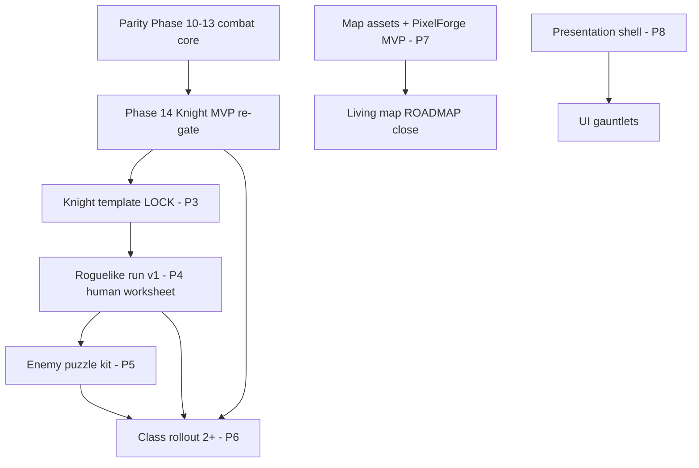

# Remaining Work — Design Suite Implementation Plan (v3)

**Status:** `POLISHED` (critic pass **C6 = 91/90** — owner **gate** pending for LOCK)  
**Authority:** User goals (map, SFX, UI, classes, run, Knight, enemies, agent looping, PixelForge)  
**Gauntlet spec:** [`00-gauntlet-loop-cursor.md`](00-gauntlet-loop-cursor.md)  
**Progress log:** [`workbench.md`](workbench.md)

## Goal

Single agent-executable plan to create all `docs/design/` pillar specs (W1–W4): master map, template, verification matrix, and nine domain contracts — without duplicating `ROADMAP.md` / parity plan bodies.

## Quality bar

| Deliverable | Machine check | Human check |
|-------------|---------------|-------------|
| This plan | `.\scripts\lint_design_doc.ps1` PASS | — |
| Harsh gauntlet | `gauntlet-critic` `RESULT: PASS` + **SCORE ≥ 90** (`PASS_THRESHOLD: 90`) | Owner LOCK on sequencing |
| W1 outputs | Paths in file tree exist or README marks `W1 — not written` | — |
| Verification | Inline matrix rows cite paths that exist on disk (or `PLANNED — W1`) | — |

This file is the **implementation plan for creating all remaining-work documents**. It is loop-polished via the doc-polish gauntlet (ledger below). Game work itself lives in pillar specs once written — starting with [`REMAINING_WORK_MAP.md`](REMAINING_WORK_MAP.md) (Wave W1).

---

## Doc-polish gauntlet ledger

| Pass | Critic focus | Score (/100) | Largest gap | Status |
|------|--------------|--------------|-------------|--------|
| C1 | Structure (v1 → master map + 9 pillars) | — *(pre-/100)* | No single master map | v2 drafted |
| C2 | Completeness vs repo | — *(pre-/100)* | P0 duplicated gauntlet doc | v3 drafted |
| C3 | Executability (paths, waves) | — *(pre-/100)* | lint script staged | v3 on disk |
| **C4–C6** | **Harsh gauntlet-critic** | **54 → 82 → 87 → 88 → 89 → 91** | Naming harmonized | **PASS** |
| **Owner gate** | You: LOCK map + worksheets | TBD | `REMAINING_WORK_MAP.md` + P4/P7 | **after POLISHED ≥90** |

**Pass rule (this plan):** `gauntlet-critic` **`RESULT: PASS`** and **`SCORE ≥ 90`** (`PASS_THRESHOLD: 90` for meta docs per Rule 4b). Legacy `avg ≥ 8.0` rubric retired.

**Naming:** **Critic pass** = harsh subagent score. **Owner gate** = human LOCK only after POLISHED — not a critic pass number.

---

## Round 2 — Critic (completeness)

**Artifact judged:** Plan v2 (9 pillars, 4 waves, three layers).

| # | Dimension | v2 | Gap |
|---|-----------|-----|-----|
| 1 | Covers user-named areas | 8 | Networking/co-op correctly deferred; **triage/autobattler** only in appendix — add row in verification matrix |
| 2 | Objective bars per pillar | 7 | Matrix described, not **filled** with repo script paths |
| 3 | Sequencing | 6 | Critical path generic; must anchor **Parity Plan Phases 10–14** before roguelike |
| 4 | Avoids sprawl / duplication | 8 | Good delta rule; **P0 overlaps** `00-gauntlet-loop-cursor.md` |
| 5 | Agent-executable | 8 | Gauntlet + critic exist on disk; doc suite had no single plan file |
| 6 | Human vs agent boundaries | 7 | Roguelike worksheet named but **empty template** missing |
| 7 | Tooling (PixelForge) | 8 | Appendix correct; needs `docs/asset_manifest.md` + `tile_registry.md` in I/O chain |
| 8 | Loop-polishable | 5 | v2 lived only in chat — **not on disk** |

**Round 2 result: FAIL** (avg 7.1; dimensions 3 and 8 below threshold)

**Largest gap:** Plan was not executable against **current repo truth** (parity phase numbers, existing gauntlet infra, real QA commands).

---

## Round 3 — Critic (executability)

| Check | Result |
|-------|--------|
| `run_planning_qa_gate.ps1` exists | PASS |
| `run_regression_tests.ps1` exists | PASS |
| `planning_skill_scenarios_test.gd` in gate | PASS (`tests/run_planning_qa_gate.gd`) |
| `PLANNING_SKILL_QA_CHECKLIST.md` (7 phases) | PASS |
| `mass_sim_*` + `run_mass_sim_test.gd` | PASS (Godot CLI — no PS1 wrapper) |
| `lint_design_doc.ps1` | PASS — on disk at `scripts/lint_design_doc.ps1`; exempts operational gauntlet OS |
| P0 duplicate of gauntlet doc | PASS — merge strategy in file tree |
| Suite plan file on disk | PASS |

**Round 3 result:** PASS with 1 deferred (owner lock → **Owner gate**)

---

## Design principle: three layers

```
Layer 0 — MASTER MAP       REMAINING_WORK_MAP.md (game milestones, one page)
Layer 1 — PILLAR SPECS     ~9 agent contracts (deltas only)
Layer 2 — APPENDICES       tools, formats, prompt library
```

**Canonical docs are not replaced.** Pillar specs link **authority chain** and add **goal + bar + gauntlet stub** only.

| Keep authoritative | Pillar adds |
|--------------------|-------------|
| `ROADMAP.md` | Living-map remaining phases + compositor gates |
| `docs/TACTICAL_COMBAT_PARITY_PLAN.md` | Open items Phases 10–14 + retirement checklist |
| `class_abilities.txt` | Per-class rollout checklists |
| `docs/PLANNING_QA_GATE.md` | Pointers only — never duplicate Tier 3 |
| `IMPLEMENTATION_STATUS.md` | Status row per pillar when work starts |
| `docs/design/00-gauntlet-loop-cursor.md` | **Runtime gauntlet OS** — not duplicated |

---

## Critical path (repo-aligned)

Current truth: **Phase 9 FAIL**; **Parity Plan Phases 10–14** are the combat spine; roguelike is not started.



**Bar for Layer 0 map:** Every node = **one pillar doc** + **one primary command** (see verification matrix).

---

## File tree (v3 — consolidated)

```
docs/design/
├── README.md                              # Index + polish status table (W1)
├── 00-remaining-work-suite-plan.md        # THIS FILE — how to create the suite
├── 00-gauntlet-loop-cursor.md             # EXISTS — runtime gauntlet OS (≈ P0 runtime)
├── 01-doc-polish-protocol.md              # P1 — how any doc reaches POLISHED (W1)
├── UNATTENDED_RUN.md                      # EXISTS
├── workbench.md                           # EXISTS
├── _TEMPLATE.md                           # PLANNED — W1
├── REMAINING_WORK_MAP.md                  # PLANNED — W1
├── verification-matrix.md                 # PLANNED — W1 (draft inline below until extracted)
│
├── combat-core-closeout.md                # PLANNED — W2
├── knight-template.md                     # PLANNED — W2
├── roguelike-run.md                       # PLANNED — W2
├── enemy-design.md                        # PLANNED — W3
├── class-rollout.md                       # PLANNED — W3
├── world-assets-and-map.md                # PLANNED — W3
├── presentation-audio-ui.md               # PLANNED — W3
│
└── appendices/
    ├── pixelforge-v14-contract.md         # PLANNED — W3
    ├── mass-sim-balance.md                # PLANNED — W4
    ├── encounter-fixture-format.md        # PLANNED — W2 stub → W3 expand
    └── gauntlet-prompt-library.md         # PLANNED — W4
```

**P0 naming:** Do **not** add `00-agentic-operating-system.md`. Pillar P0 = **`00-gauntlet-loop-cursor.md`** + **`01-doc-polish-protocol.md`**.

**Deferred appendices until needed:** co-op, tutorial, autobattler HUD (Parity Phase 15).

---

## Shared template (`_TEMPLATE.md`) — W1

Every pillar spec **must** include:

1. **Pillar ID** (P2–P9) + link from `REMAINING_WORK_MAP.md`
2. **Status:** `DRAFT | LOOP_READY | POLISHED | LOCKED`
3. **Authority chain** (bullets — no prose duplication of Bible/ROADMAP)
4. **Goal / non-goals** (≤5 bullets each)
5. **Quality bar table:** `Deliverable | Machine check | Human check`
6. **Human-only worksheet** (table or `N/A`)
7. **Decomposition** (independently verifiable chunks)
8. **Builder playbook** (ordered; files/systems)
9. **Critic playbook** (commands only)
10. **Gauntlet stub** (lead prompt, 3 paragraphs max)
11. **Tooling I/O** (inputs → outputs → consumer path)
12. **Exit criteria** (checkboxes)
13. **Doc polish scorecard** (8 dimensions before POLISHED)

---

## Verification matrix (P9 — authoritative copy: `verification-matrix.md`)

| Pillar | Primary machine bar | Secondary | Human gate |
|--------|---------------------|-----------|------------|
| **P2** combat closeout | `.\scripts\run_regression_tests.ps1` | `.\scripts\run_planning_qa_gate.ps1` | F5 Phase 10–14 manual lists in parity plan |
| **P3** knight template | `.\scripts\run_planning_qa_gate.ps1` | `tests/run_skill_scenarios_only.gd` | `docs/PLANNING_SKILL_QA_CHECKLIST.md` |
| **P4** roguelike run | `PLANNED — tests/run_state_test.gd` | — | **Worksheet required** (below) |
| **P5** enemy design | `tests/bridge_test_runner.gd` | `docs/design/appendices/encounter-fixture-format.md` | Puzzle fun |
| **P6** class rollout | `.\scripts\run_planning_qa_gate.ps1` | `tests/run_mass_sim_test.gd` | Balance taste |
| **P7** world/map | `docs/asset_manifest.md` | `PLANNED — F5 compositor gate (phase-audit.mdc)` | P7 worksheet |
| **P8** presentation | `PLANNED — Sfx event map (P8 doc)` | `docs/design/presentation-audio-ui.md` | Typography/layout |
| **P9** matrix | `.\scripts\lint_design_doc.ps1` | `.cursor/agents/gauntlet-critic.md` | Owner LOCK |
| **Triage / autobattler** | `tests/run_mass_sim_test.gd` | `docs/design/appendices/mass-sim-balance.md` | Owner |
| **Docs (meta)** | `.\scripts\lint_design_doc.ps1` | `docs/design/01-doc-polish-protocol.md` | Owner LOCK (SCORE ≥88 pillar / ≥90 meta) |

**Mass sim CLI (document in appendix):**

```text
godot --headless --path <repo> --script res://tests/run_mass_sim_test.gd
```

---

## Human-only worksheets (templates)

### P4 — Roguelike run (you fill before P4 = LOOP_READY)

| Decision | Your answer |
|----------|-------------|
| Run length (rooms / floors / time) | |
| Map structure (linear / branching / grid) | |
| Death rules (permadeath / checkpoint) | |
| Meta-progression (yes/no; what persists) | |
| Co-op in v1 run loop (yes/no) | |
| Save model (`user://` schema owner) | |

### P7 — Art direction (you fill before P7 = LOOP_READY)

| Decision | Your answer |
|----------|-------------|
| Replace Mana Seed vs augment | |
| PixelForge CANON promote authority | *(default: you only)* |
| Reference mood boards / PNG paths | |
| Seasonal / biome priority order | |

---

## Wave delivery (implementation order)

### W1 — Spine + meta (first unattended chunk)

| Output | Status on disk | Bar |
|--------|----------------|-----|
| `README.md` | **EXISTS** | Index + polish status table |
| `_TEMPLATE.md` | PLANNED — W1 | Template sections present |
| `01-doc-polish-protocol.md` | PLANNED — W1 | Matches Rule 4b + 6b in gauntlet spec |
| `REMAINING_WORK_MAP.md` | PLANNED — W1 | Every milestone → pillar + command |
| `verification-matrix.md` | PLANNED — W1 (draft inline below until extracted) | All paths exist or marked `PLANNED` |
| `scripts/lint_design_doc.ps1` | **EXISTS** | Pillar `## Goal` + `## Quality bar`; exempt operational docs |

**W1 gauntlet:** builder writes → **`/gauntlet-critic`** with `PASS_THRESHOLD: 90`, BAR = lint script + matrix path grep → fix largest gap → repeat until `RESULT: PASS` **and** `SCORE ≥ 90`.

### W2 — Combat spine docs

| Output | Status on disk | Bar |
|--------|----------------|-----|
| P2 `combat-core-closeout.md` | PLANNED — W2 | Open parity Ph10–14 deltas only |
| P3 `knight-template.md` | PLANNED — W2 | Shield Bash scenario + checklist phases |
| P4 `roguelike-run.md` | PLANNED — W2 | Human worksheet filled |
| `appendices/encounter-fixture-format.md` | PLANNED — W2 | Schema fields listed |

**Depends on:** W1 LOOP_READY or POLISHED.

### W3 — Content + world

| Output | Status on disk | Bar |
|--------|----------------|-----|
| P5 `enemy-design.md` | PLANNED — W3 | Encounter fixture → sim smoke |
| P6 `class-rollout.md` | PLANNED — W3 | Clone P3 + mass-sim hooks |
| P7 `world-assets-and-map.md` | PLANNED — W3 | PixelForge → `asset_manifest.md` |
| P8 `presentation-audio-ui.md` | PLANNED — W3 | SFX event map + UI inventory |
| `appendices/pixelforge-v14-contract.md` | PLANNED — W3 | Matches v14 entities |

### W4 — Prompt library + balance

| Output | Status on disk | Bar |
|--------|----------------|-----|
| `appendices/gauntlet-prompt-library.md` | PLANNED — W4 | Prompts runnable without editing |
| `appendices/mass-sim-balance.md` | PLANNED — W4 | When to run `run_mass_sim_test.gd` |

**Human gate between waves:** you read `REMAINING_WORK_MAP.md` + P4/P7 worksheets only.

---

## Doc-polish protocol (P1 summary — full file in W1)

For **any** design doc (including this plan):

1. **Builder** drafts from authority docs + grep — not from memory.
2. **Lead** invokes **`gauntlet-critic`** (readonly) with §9 handoff from `00-gauntlet-loop-cursor.md` — **no builder chat log**.
3. **Critic** returns `RESULT`, **`SCORE: x/100`**, largest gap, evidence. **PASS only if** BAR passes **and** `SCORE ≥ PASS_THRESHOLD` (85 code / 88 docs / 90 meta — see gauntlet spec Rule 4b).
4. **Builder** fixes largest gap → repeat until PASS gate met or `MAX_ROUNDS_PER_PIECE` → `FAILURE_REPORT.md`.
5. **Status promotion:** `DRAFT` → `LOOP_READY` (critic PASS + score ≥ 88) → `POLISHED` (score ≥ 90 on meta docs, ≥ 88 on pillars) → `LOCKED` (owner).

**Doc BAR:**

| Stage | Machine check | Harsh critic |
|-------|----------------|--------------|
| LOOP_READY | `lint_design_doc.ps1` PASS on this file | `SCORE ≥ 88`, `PASS_THRESHOLD: 88` |
| POLISHED | W1 paths accurate; matrix extracted or inline marked | `SCORE ≥ 90`, `PASS_THRESHOLD: 90` |
| LOCKED | Owner reply + commit hash in header | — |

---

## `lint_design_doc.ps1` (exists — maintain in W1+)

Checks (PowerShell):

- Every `docs/design/*.md` except README exempt list has: `**Status:**`, `## Goal`, `## Quality bar`
- **Exempt (operational / meta):** `workbench.md`, `UNATTENDED_RUN.md`, `README.md`, `00-gauntlet-loop-cursor.md`
- **Not exempt:** pillar specs and this suite plan (must include Goal + Quality bar)
- No pillar body pastes full `ROADMAP.md` / parity plan sections (&gt;40 consecutive lines = FAIL) — *future lint rule W1b*

---

## PixelForge placement

**Owner:** `appendices/pixelforge-v14-contract.md`

- `ASSET_SPECIFICATION` ↔ `docs/asset_manifest.md` + `docs/tile_registry.md`
- Export paths under `res://` that Godot scenes already reference
- **Bar:** promoted CANON → manifest row + nearest filter + F5 compositor gate
- **Agent rule:** propose only; CANON promote = human (v14)

---

## Anti-patterns (suite-specific)

| Anti-pattern | Fix |
|--------------|-----|
| Duplicating `00-gauntlet-loop-cursor.md` as P0 | Point to existing file |
| Self-grading plan v2 in chat only | This file on disk + critic PASS |
| Roguelike spec before worksheet filled | P4 stays DRAFT |
| Pillar pastes parity plan phases | Link + open-items table only |
| Claiming POLISHED without `gauntlet-critic` | workbench `Critic: yes` column |

---

## Suggested next action

| Option | What happens |
|--------|----------------|
| **W1 unattended** | Fill `UNATTENDED_RUN.md` for chunk `design-suite-w1`; lead gauntlets W1 files |
| **Owner gate (you)** | Fill P4/P7 worksheets; reply **LOCK** on sequencing — **only after** this plan is `POLISHED` (SCORE ≥ 90) |
| **Adjust** | Change pillar list, wave order, or deferrals |

**Note:** **Critic passes** (C1–C5 harsh scores) are separate from the **owner gate**. Do not run owner LOCK until `POLISHED`.

---

## Changelog (this document)

| Date | Change |
|------|--------|
| 2026-08-01 | v3: Rounds 2–3 gauntlet; repo-aligned path; P0 merge; verification matrix draft; W1 lint spec |
| 2026-08-01 | Harsh score gate aligned with gauntlet-critic Rule 4b (88/90 doc thresholds) |
| 2026-08-01 | Gauntlet test loop C1–C6: 54→91/90 PASS; POLISHED status; workbench score progression |
