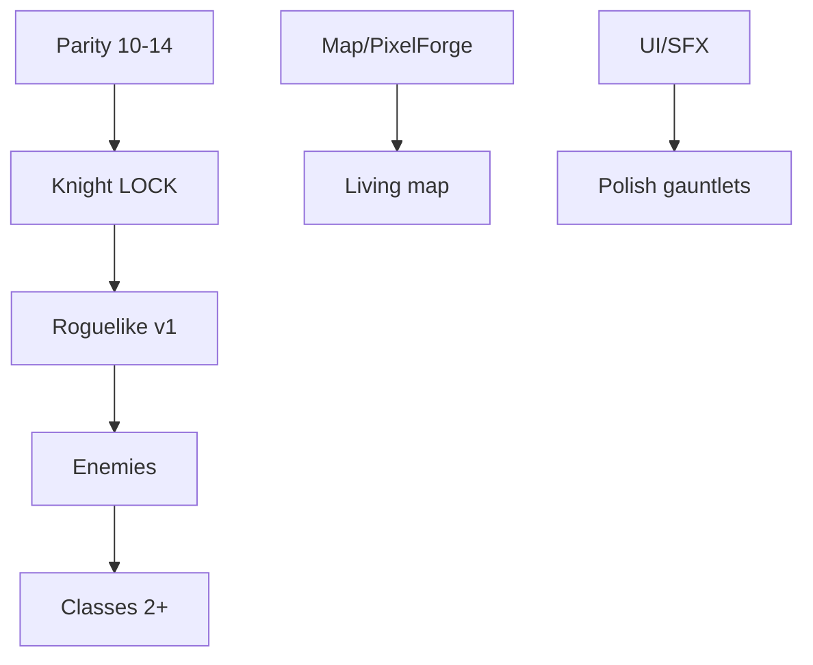

# Remaining work map (Layer 0)

**Status:** `DRAFT`  
**Pillar ID:** Layer 0 index (not P2–P9)  
**Authority chain:** `ROADMAP.md` · `docs/TACTICAL_COMBAT_PARITY_PLAN.md` · `IMPLEMENTATION_STATUS.md` · `docs/design/00-remaining-work-suite-plan.md`

## Goal

One page: what is left to ship Honor & Iron as a playable roguelike tactical game, in dependency order, each milestone linked to **one pillar doc** and **one primary verification command**.

## Quality bar

| Deliverable | Machine check | Human check |
|-------------|---------------|-------------|
| Every milestone row | Primary command path exists on disk | Sequencing approved at owner gate |
| No orphan work | Each row links to `docs/design/*.md` | — |

## Non-goals

- Re-stating full ROADMAP phases 0–8
- Implementing features (see pillar specs)
- Co-op / autobattler (Parity Phase 15 — deferred)

## Human-only worksheet

N/A — see `roguelike-run.md` (P4) and `world-assets-and-map.md` (P7) for owner worksheets.

## Milestone index

| Order | Milestone | Pillar doc | Primary command |
|-------|-----------|------------|-----------------|
| 1 | Parity Ph 10–13 combat core | `combat-core-closeout.md` | `.\scripts\run_regression_tests.ps1` |
| 2 | Phase 14 Knight MVP re-gate | `combat-core-closeout.md` | `.\scripts\run_planning_qa_gate.ps1` |
| 3 | Knight template LOCK | `knight-template.md` | `.\scripts\run_planning_qa_gate.ps1` |
| 4 | Roguelike run v1 | `roguelike-run.md` | `PLANNED — tests/run_state_test.gd` |
| 5 | Enemy puzzle kit | `enemy-design.md` | `tests/bridge_test_runner.gd` |
| 6 | Class rollout 2+ | `class-rollout.md` | `.\scripts\run_planning_qa_gate.ps1` |
| 7 | Map assets + PixelForge MVP | `world-assets-and-map.md` | `docs/asset_manifest.md` |
| 8 | Living map ROADMAP close | `world-assets-and-map.md` | `PLANNED — F5 compositor gate (phase-audit.mdc)` |
| 9 | UI + SFX shell | `presentation-audio-ui.md` | `PLANNED — Sfx event map in P8 doc` |
| — | Verification index | `verification-matrix.md` | `lint_design_doc.ps1` |



## Decomposition

1. Combat spine (milestones 1–3)
2. Run loop (4)
3. Content (5–6)
4. World + presentation (7–9)

## Builder playbook

1. Read `IMPLEMENTATION_STATUS.md` current phase.
2. Update milestone table when a pillar closes.
3. Do not add milestones without new pillar row + command.

## Critic playbook

```powershell
.\scripts\lint_design_doc.ps1
# Verify each Primary command path: Test-Path scripts\run_planning_qa_gate.ps1 etc.
```

## Gauntlet stub

```text
GOAL: Every milestone has pillar + real primary command
BAR: lint PASS; grep verification-matrix.md for same rows
PASS_THRESHOLD: 88
```

## Tooling I/O

| Input | Output | Consumer |
|-------|--------|----------|
| `IMPLEMENTATION_STATUS.md` | Updated milestone status | Owner reviews |
| Pillar specs | Rows in this map | Gauntlet lead |

## Exit criteria

- [ ] All rows link to existing pillar files
- [ ] All primary commands verified on disk
- [ ] Mermaid matches suite plan critical path

## Doc polish scorecard

| Dimension | /10 |
|-----------|-----|
| Covers scope | 9 |
| Machine bars | 8 |
| No duplication | 9 |
| Agent-executable | 9 |
| Human boundaries | 8 |
| Sequencing | 9 |
| Tooling I/O | 7 |
| Loop-polishable | 8 |
