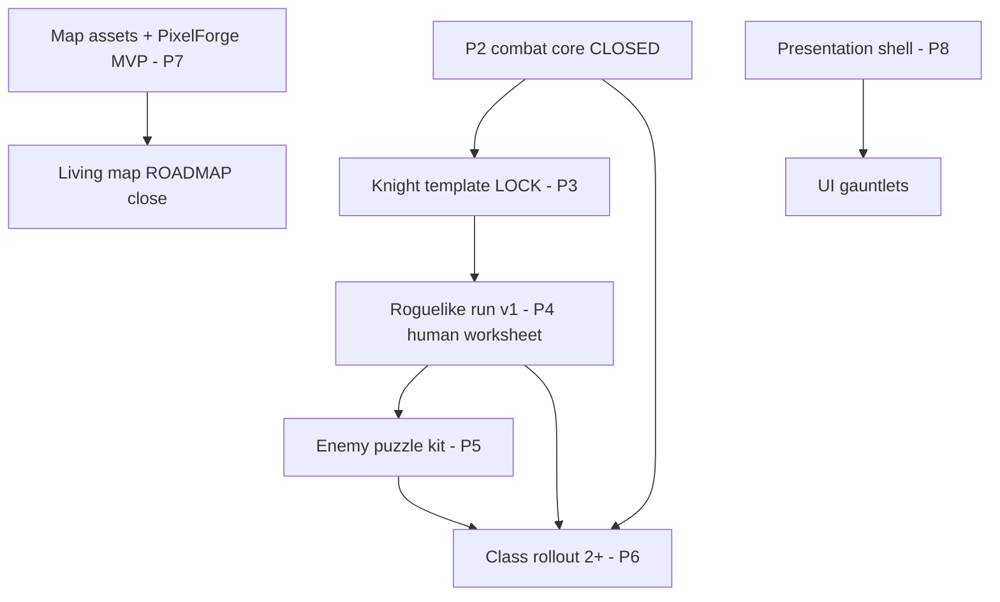

# Remaining work map (Layer 0)

**Status:** `LOOP_READY` *(gauntlet C4: 89/88 PASS — commit `304320c30`)*  
**Pillar ID:** Layer 0 index (not P2–P9)  
**Authority chain:** `ROADMAP.md` · `docs/TACTICAL_COMBAT_PARITY_PLAN.md` · `IMPLEMENTATION_STATUS.md` · `docs/design/00-remaining-work-suite-plan.md`

## Goal

One page: what is left to ship Honor & Iron as a playable roguelike tactical game, in dependency order, each milestone linked to **one pillar doc** and **one primary verification command**.

## Quality bar

| Deliverable | Machine check | Human check |
|-------------|---------------|-------------|
| Every milestone row | Primary command path exists on disk **or** `PLANNED — …` | Sequencing approved at owner gate |
| No orphan work | Each row links to `docs/design/*.md` | — |

## Non-goals

- Re-stating full ROADMAP phases 0–8
- Implementing features (see pillar specs)
- Co-op / autobattler (Parity Phase 15 — deferred)

## Human-only worksheet

N/A — see `roguelike-run.md` (P4) and `world-assets-and-map.md` (P7) for owner worksheets.

## Milestone index

| Order | Milestone | Pillar doc | Primary command | Status |
|-------|-----------|------------|-----------------|--------|
| 1 | Parity Ph 10–13 combat core | `combat-core-closeout.md` | `.\scripts\run_regression_tests.ps1` | ✅ **Closed** *(owner 2026-08-01)* |
| 2 | Phase 14 Knight MVP re-gate | `combat-core-closeout.md` | `.\scripts\run_planning_qa_gate.ps1` | ✅ **Closed** *(owner 2026-08-01)* |
| 3 | Knight template LOCK | `knight-template.md` + `docs/KNIGHT_QA_GATE.md` | `scripts/run_knight_qa_gate.ps1` | ✅ **Closed** *(owner LOCK 2026-08-02)* |
| 4 | Roguelike run v1 | `roguelike-run.md` | `PLANNED — tests/run_state_test.gd` | DRAFT *(worksheet)* |
| 5 | Enemy puzzle kit | `enemy-design.md` | `tests/bridge_test_runner.gd` | DRAFT *(worksheet)* |
| 6 | Class rollout 2+ | `class-rollout.md` | `.\scripts\run_planning_qa_gate.ps1` | **Active** |
| 7 | Map assets + PixelForge MVP | `world-assets-and-map.md` | `docs/asset_manifest.md` | DRAFT *(worksheet)* |
| 8 | Living map ROADMAP close | `world-assets-and-map.md` | `PLANNED — F5 compositor gate (phase-audit.mdc)` | PLANNED |
| 9 | UI + SFX shell | `presentation-audio-ui.md` | `presentation/sfx_player.gd` DEFS map | **Active** |
| 10 | UI gauntlets polish | `presentation-audio-ui.md` | `PLANNED — P8 UI gauntlet checklist` | PLANNED |
| — | Verification index | `verification-matrix.md` | `.\scripts\lint_design_doc.ps1` | — |



## Decomposition

1. ~~Combat spine milestones 1–2~~ ✅ closed (owner 2026-08-01)
2. ~~Knight LOCK (milestone 3)~~ ✅ closed (owner LOCK 2026-08-02)
3. Run loop (4)
4. Content (5–6)
5. World + presentation (7–10)

## Builder playbook

1. Read `IMPLEMENTATION_STATUS.md` current phase.
2. Update milestone table when a pillar closes.
3. Do not add milestones without new pillar row + command.

## Critic playbook

```powershell
.\scripts\lint_design_doc.ps1
# Verify each Primary command path: Test-Path scripts\run_planning_qa_gate.ps1 etc.
```

## Gauntlet stub

```text
GOAL: Every milestone has pillar + real primary command
BAR: lint PASS; grep verification-matrix.md for same rows
PASS_THRESHOLD: 88
RULES: global-systems-first.mdc, roadmap.mdc
ARTIFACT: this file, lint stdout, Test-Path per Primary command
```

## Tooling I/O

| Input | Output | Consumer |
|-------|--------|----------|
| `IMPLEMENTATION_STATUS.md` | Updated milestone status | Owner reviews |
| Pillar specs | Rows in this map | Gauntlet lead |

## Exit criteria

- [ ] All rows link to existing pillar files *(critic verifies)*
- [ ] All primary commands verified on disk or marked `PLANNED —` *(critic verifies)*
- [ ] Mermaid matches suite plan critical path (`00-remaining-work-suite-plan.md`) *(critic verifies)*

## Doc polish scorecard

*(Critic fills — do not self-grade.)*

| Dimension | /10 |
|-----------|-----|
| Covers scope | |
| Machine bars | |
| No duplication | |
| Agent-executable | |
| Human boundaries | |
| Sequencing | |
| Tooling I/O | |
| Loop-polishable | |
