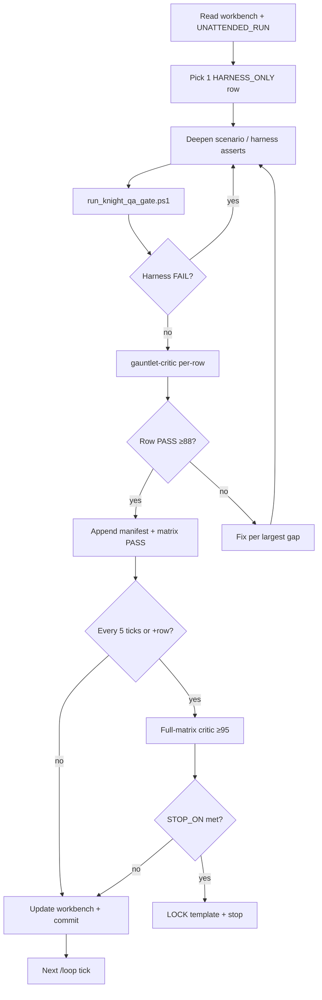

# Gauntlet run card — K3-LOCK

**Parent:** [`../UNATTENDED_RUN.md`](../UNATTENDED_RUN.md) (ACTIVE)  
**Pillar:** [`../knight-template.md`](../knight-template.md)  
**Matrix:** [`../../KNIGHT_QA_GATE.md`](../../KNIGHT_QA_GATE.md)  
**Manifest:** [`../../knight_meta_critic_manifest.json`](../../knight_meta_critic_manifest.json)

---

## One-line goal

**LOCK the Knight template** — 30/30 factory rows meta-critic approved, `run_knight_qa_gate.ps1` exit 0, full-matrix gauntlet-critic **≥ 95**.

---

## Start the loop (owner)

1. Confirm Godot path in `UNATTENDED_RUN.md` works on this PC.
2. Open **Agent** (Composer 2.5) in this repo.
3. Paste and send:

```text
/loop 20m UNATTENDED GAUNTLET — knight-k3-lock

Read docs/design/UNATTENDED_RUN.md (ACTIVE K3-LOCK).
Read docs/design/runs/K3-LOCK.md.
Read docs/design/00-gauntlet-loop-cursor.md Rules 4, 5c, 6b, §5.4.
Read docs/design/workbench.md — continue from last round.

You are the LEAD. Do not ask the owner questions.

Each tick: one row from HARNESS_ONLY queue → builder → run_knight_qa_gate.ps1 → gauntlet-critic → score banner → workbench STOP_CONDITION_MET → commit.

FORBIDDEN: knight_bowling_charge / knight_trampling_advance regression; planning QA edits; self-grade manifest.

Stop only when STOP_ON success (30/30, gate exit 0, critic ≥95) or BLOCKER requiring owner.
```

4. Leave Cursor open; PC awake.
5. Morning: check `workbench.md` **Score ticker** and `STOP_CONDITION_MET`.

---

## What “done” looks like

| Check | Target |
|-------|--------|
| `run_knight_qa_gate.ps1` | Exit **0**, stdout `[PASS] Knight QA gate` |
| Matrix | `30 / 30` PASS in `KNIGHT_QA_GATE.md` |
| Manifest | 30 `approved_rows` in `knight_meta_critic_manifest.json` |
| Critic | Full-matrix `RESULT: PASS`, `SCORE ≥ 95`, `Infrastructure: ADEQUATE` |
| Template | `knight-template.md` status **`LOCKED`** |
| Workbench | `STOP_CONDITION_MET: yes` |

---

## What is NOT done

| Signal | Why insufficient |
|--------|------------------|
| Tier 1 harness green | Gate can exit **2** with 14/30 |
| Matrix count climb | Rows need **critic** manifest entry each |
| Score 57 → 80 | Threshold is **95** on full matrix |
| “LOOP_ACTIVE” message | Rule 5c — must continue or BLOCKER |

---

## Tick strategy (lead)



---

## Approved rows (30 — manifest complete)

All 30 `knight_factory.gd` rows in `docs/knight_meta_critic_manifest.json`. Full-matrix LOCK critic r37: **92/95 FAIL** — see `workbench.md` planning tiers.

---

## Remaining work (LOCK — not HARNESS_ONLY)

Full-matrix gauntlet-critic **≥ 95**; `knight-template.md` → **LOCKED**; ally-target planning commit for `knight_fortify` / `knight_swap` (presentation scope) or owner tiered-LOCK approval.

**No-regression:** `knight_bowling_charge`, `knight_trampling_advance` — assert depth only.
---

## Per-row critic handoff (template)

```text
PIECE: K3-LOCK row — <factory_id>
GOAL: Promote <factory_id> from HARNESS_ONLY → PASS per KNIGHT_QA_GATE.md scenario contract
BAR: .\scripts\run_knight_qa_gate.ps1; read tests/skills|passives/<id>_scenario.gd + tests/knight_qa_harness.gd
PASS_THRESHOLD: 88
RULES: skill-global-rules.mdc, global-systems-first.mdc — Rule A/B in KNIGHT_QA_GATE.md
ARTIFACT: scenario file path, harness assert names, gate stdout excerpt, Bible clause
Do not implement. Row-level PASS/FAIL + Fix target + evidence.
```

---

## Failure report trigger

Write `docs/design/FAILURE_REPORT.md` if:

- 40 full-piece rounds without STOP_ON
- FORBIDDEN path touched (planning QA, bowling/trample regression)
- Self-grade caught (gate exit **3**)

---

## Related commands

```powershell
# Primary BAR (every tick)
.\scripts\run_knight_qa_gate.ps1

# Only if core/systems changed
.\scripts\run_regression_tests.ps1 -GodotPath "C:\Users\Kendy\Downloads\Godot_v4.7-stable_win64.exe\Godot_v4.7-stable_win64.exe"

# Doc lint (optional sanity)
.\scripts\lint_design_doc.ps1
```
